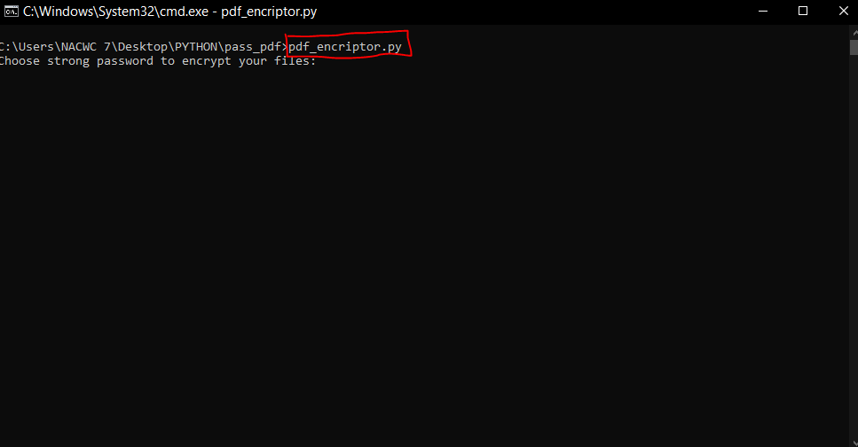

# PDF_ENCRIPTOR
Encript multiple PDF Files with Python

Project Name: PDF ENCRIPTOR

# Setup
1.  Clone This Project git clone https://github.com/Muri68/PDF_ENCRIPTOR.git

2.  Enter Project Directory:- cd PDF_ENCRIPTOR

3.  Install the Required Package:- pip install pikepdf

4.  Finally Run The Project:- pdf_encriptor.py

# Preview

